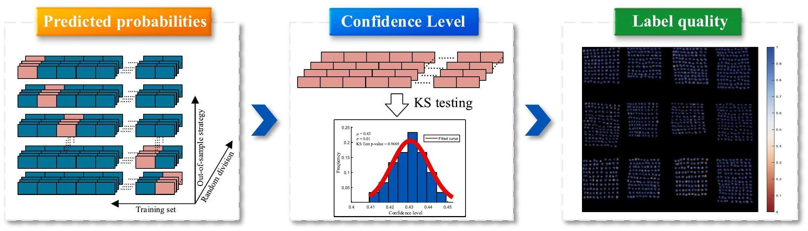

# CL-ST
This code is for “Identifying Moldy Peanut Using Hyperspectral Imaging by Correction of Noisy Labelling”

## Identifying moldy peanut using hyperspectral imaging by correction of noisy labelling(FRI2025)

Paper web page: [Identifying moldy peanut using hyperspectral imaging by correction of noisy labelling](https://www.sciencedirect.com/science/article/abs/pii/S0963996925010798?via%3Dihub#bi0005).



# Abstract:

<p style="text-align: justify;">
    Aflatoxin, a secondary metabolite synthesized by moldy peanuts, poses a significant and potentially fatal threat to human health. Hyperspectral imaging technology combined with supervised learning algorithms has become an essential method for rapid, non-destructive identification of moldy peanuts. However, it is impossible to measure the aflatoxin content of peanut kernel at pixel-level, weak labels is commonly phenomenon when initially labeling moldy regions within peanut hyperspectral images, which leads to an inevitable issue—noisy label. In this study, a label quality quantification framework which integrate confidence level and statistical testing (CL-ST) is proposed to find label errors of moldy peanut hyperspectral images. First, confidence level of initial artificial labeling is estimated using out-of-sample probability. Furthermore, label quality is assessed through statistical testing and ranked in descending order. Finally, the optimal noisy rate (NR) is determined based on moldy peanut kernel-scale identification performance, and the models with clean data as input is rebuilt to identify moldy peanuts. Experimental results show that CL-ST can reliably quantify label quality of hyperspectral images and effectively identify potential noisy labeled pixels. The rebuilt successive projection algorithm-extreme learning machine achieve optimal performance, improving overall accuracy and precision from 74.63 % and 66.21 % to 98.96 % and 97.09 %, respectively. Feature visualization analysis reveals that noisy labels are the primary cause of incorrect decision boundaries, although their impact on feature selection is limited. CL-ST does not require hyperparameters and can be combined with any model to quantify label quality, demonstrating significant potential in food quality assessment using hyperspectral images.
</p>

### Demo
Demo for CL-ST

You can directly test the CL-ST on demo data.

If you want to train it on other datasets, please modify the data path and feature bands.


# Citations:

If you find the code helpful in your research or work, please cite the following paper:

```
@ARTICLE{9762261,
  author={Deshuai Yuan, Yanqing Xie, Wenchao Qi,Ruoxi Song},
  journal={Food Research International}, 
  title={Identifying moldy peanut using hyperspectral imaging by correction of noisy labelling}, 
  year={2025},
  volume={217},
  number={},
  pages={116741},
  doi={10.1016/j.foodres.2025.116741}}
```

# Requirements：

```
1. Python 3.10
2. Cleanlab
......

You can configure the environment directly using the following command:
conda create -n noisyclean python=3.10 numpy=1.26 scipy matplotlib scikit-learn pandas opencv -y
pip install cleanlab[datalab]
```

# Usage:

```
1. Run main.py
```
### Replication Information:

Deshuai Yuan,

Aerospace Information Research Institute, Chinese Academy of Sciences,

December 25, 2025
